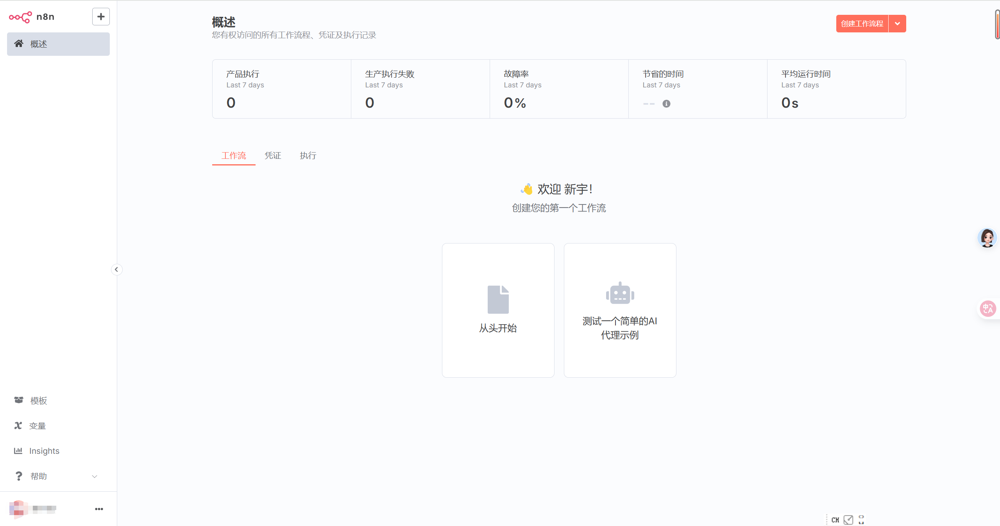

# N8N 中文版 Docker 镜像

这个项目自动构建包含中文支持的n8n Docker镜像。基于[n8n-i18n-chinese](https://github.com/other-blowsnow/n8n-i18n-chinese)项目的汉化包。

如果你已经在使用n8n官方镜像，只需要将镜像名称从 `n8nio/n8n` 替换为 `a1007479270gm/n8ncn` 即可启用中文界面。



## 使用方法

```bash
docker run -it --rm \
  -p 5678:5678 \
  -v ~/.n8n:/home/node/.n8n \
  -e N8N_DEFAULT_LOCALE=zh-CN \
  a1007479270gm/n8ncn:latest
```

## 交流群

扫描下方二维码加入交流群，讨论n8n使用心得和自动化方案：


  